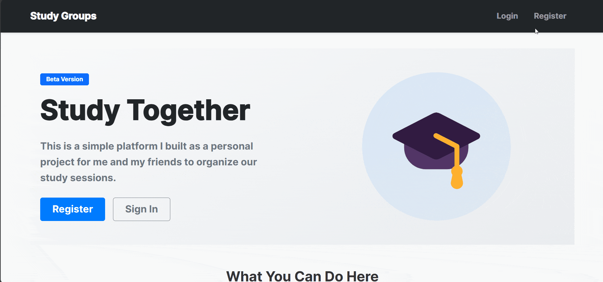
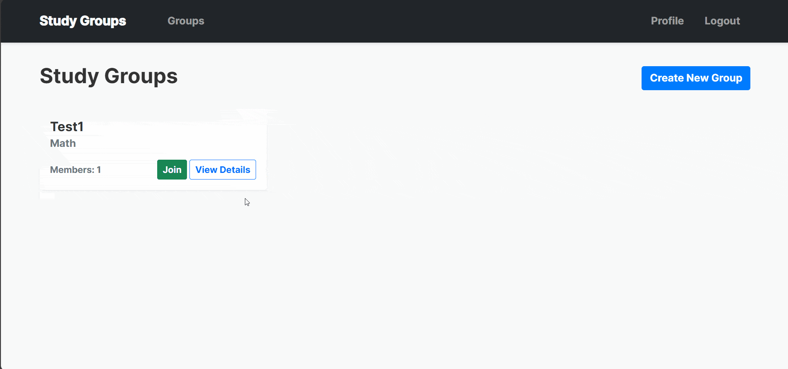

# Study Group Management Application






A Flask-based web application for creating and managing study groups, featuring real-time chat functionality, interactive session scheduling, and RSVP management. This platform helps students collaborate effectively by providing tools for group organization, communication, and session coordination.

## Features

### User Management
- Secure user authentication with password hashing
- User profile management
- Activity tracking and dashboard
- Personal session RSVP history

### Study Groups
- Create and manage study groups
- Join existing groups
- View group details and member lists
- Admin controls for group management

### Real-time Chat
- Group-specific chat rooms
- Real-time message updates
- Message history
- User presence indicators

### Session Management & RSVP
- Schedule study sessions with location and time
- Interactive RSVP system with three status options:
  - Going
  - Not Going
  - Maybe
- Real-time RSVP updates
- Comment functionality for RSVP responses
- RSVP tracking and attendance management
- Visual status indicators and counters

### Real-time Interactions
- Live chat updates
- Instant RSVP status changes
- Dynamic attendance tracking
- Real-time notification system

## Technologies Used

### Backend
- **Python 3.8+**
- **Flask**: Web framework
- **SQLAlchemy**: ORM for database management
- **Flask-Login**: User session management
- **Werkzeug**: Security and password hashing
- **Flask-WTF**: Form handling and validation

### Frontend
- **HTML5/CSS3**
- **JavaScript**: Real-time features and RSVP handling
- **Bootstrap 5**: Responsive design
- **Fetch API**: Asynchronous requests
- **Custom animations**: Enhanced user experience

### Database
- **SQLite**: Development database
- **Flask-Migrate**: Database migrations

## Installation

1. Clone the repository
```bash
git clone https://github.com/yourusername/StudyGroupApp.git
cd StudyGroupApp
```

2. Create and activate virtual environment
```bash
# Windows
python -m venv venv
venv\Scripts\activate

# macOS/Linux
python -m venv venv
source venv/bin/activate
```

3. Install dependencies
```bash
pip install -r requirements.txt
```

4. Set up environment variables
```bash
# Create .env file
FLASK_APP=run.py
FLASK_ENV=development
SECRET_KEY=your-secret-key-here
```

5. Initialize the database
```bash
flask shell
>>> from app import db
>>> db.create_all()
>>> exit()
```

6. Run the application
```bash
flask run
```

The application will be available at `http://127.0.0.1:5000`

## Project Structure
```
study_group_app/
├── app/
│   ├── __init__.py
│   ├── models.py
│   ├── routes.py
│   ├── forms.py
│   ├── static/
│   │   ├── style.css
│   │   └── js/
│   │       ├── chat.js
│   │       └── rsvp.js
│   └── templates/
│       ├── auth/
│       ├── groups/
│       └── sessions/
├── config.py
├── requirements.txt
└── run.py
```

## Usage Examples

### RSVP System Implementation
```javascript
class RSVPManager {
    async handleRSVP(event) {
        const button = event.currentTarget;
        const sessionId = button.dataset.sessionId;
        const status = button.dataset.status;
        const comment = prompt('Add a comment (optional):');

        const response = await fetch(`/sessions/${sessionId}/rsvp`, {
            method: 'POST',
            headers: {
                'Content-Type': 'application/x-www-form-urlencoded',
            },
            body: new URLSearchParams({
                status: status,
                comment: comment || ''
            })
        });

        // Handle response and update UI
    }
}
```

### Session Management
```python
@sessions_bp.route('/<int:session_id>/rsvp', methods=['POST'])
@login_required
def rsvp(session_id):
    session = StudySession.query.get_or_404(session_id)
    status = request.form.get('status')
    comment = request.form.get('comment', '').strip()
    
    rsvp = SessionRSVP(
        session_id=session_id,
        user_id=current_user.id,
        status=status,
        comment=comment
    )
    db.session.add(rsvp)
    db.session.commit()
```

## Features in Development

- [ ] Advanced RSVP analytics
- [ ] Automated reminders for sessions
- [ ] Calendar integration
- [ ] File sharing functionality
- [ ] Email notifications
- [ ] User avatars
- [ ] Advanced group settings
- [ ] Search functionality
- [ ] Mobile application
- [ ] Video chat integration

## 📄 License

This project is licensed under the MIT License - see the [LICENSE](LICENSE) file for details.
